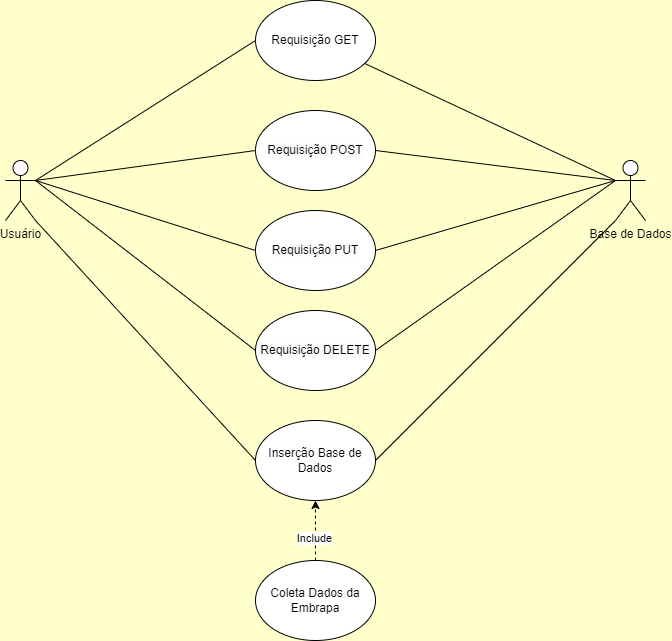

<p align="center">
  
</p>

# API-EMBRAPA

API-EMBRAPA é um projeto feito em FastAPI, um poderoso framework 
em python para desenvolvimento de APIs. 

A API consegue popular um banco de dados MySQL com dados da 
[EMBRAPA](http://vitibrasil.cnpuv.embrapa.br/index.php?opcao=opt_01) 
a partir de dados extraídos das tabelas, **'Produção'**, **'Processamento'**, **'Comercialização'**, 
**'Importação'** e **'Exportação'**.

Além disso é possível realizar um CRUD completo (Create, Read, Update e Delete) através dos endpoints 
referentes a cada uma dos tipos de tabelas.

Todos os dados já virão organizados e separados por categorias, sub-categorias, nome, anos e valores.

# Diagramação

<p align="center">
  
</p>


# Como usar

Para poder utilizar todas as funcionalidades da API, basta dispor de uma ferramenta _'API Client'_ 
como o **POSTMAN** ou o **INSOMNIA**, acrescentar a url referente a cada um dos endpoints e selecionar o tipo de 
requisição, _GET, POST, PUT OU DELETE_.
Também é possível acessar as funcionalidades através do endereço [SWAGGER](TESTE/docs), que possibilita uma 
visualização bem clara da documentação de cada um dos endpoints com descrição de cada parametro e 
body para enviar. 

# Endpoints:

## /users

### POST
Antes de utilizar a API é importante ter em mãos um token de autenticação, para este projeto foi 
escolhido o método de autentificação JWT, portanto é necessário que seja criado um usuário e senha 
para que possa ser gerado um token de autenticação que deve ser usado em todos as outras requisições.
Para criar um usuário basta realizar um _POST_ na url http://127.0.0.1:8000/auth/users/ e passar como
 payload um nome de usuário e uma senha **(criptografada na base de dados)**.

###### Observação: Não é possível criar dois ou mais usuários com o mesmo nome

#### Exemplo de requisição no python
```py
import requests
import json

url = "http://127.0.0.1:8000/auth/users/"

payload = json.dumps({
  "username": "teste",
  "password": "teste1234"
})
headers = {
  'Content-Type': 'application/json'
}

response = requests.request("POST", url, headers=headers, data=payload)

print(response.text)
```

### GET

Caso já tenha o token de usuário é possível acessar todos os usuários criados com o método _GET_.

###### Observação: Sem o token é esperado um erro 401.


#### Exemplo de requisição no python
```py
import requests

url = "http://127.0.0.1:8000/auth/users"

payload={}
headers = {
  'Authorization': 'Bearer TOKEN'
}

response = requests.request("GET", url, headers=headers, data=payload)

print(response.text)
```

### GET

Caso já tenha o token de usuário é possível acessar dados de um unico usuário pelo id 
criados com o método _GET_.

###### Observação: Sem o token é esperado um erro 401.


#### Exemplo de requisição no python
```py
import requests

url = "http://127.0.0.1:8000/auth/users/1"

payload={}
headers = {
  'Authorization': 'Bearer TOKEN'
}

response = requests.request("GET", url, headers=headers, data=payload)

print(response.text)
```

### PUT

Caso já tenha o token de usuário é possível acessar dados de um unico usuário pelo id 
criados para possíveis alterações através do método _PUT_.

###### Observação: Sem o token é esperado um erro 401.


#### Exemplo de requisição no python
```py
import requests
import json

url = "http://127.0.0.1:8000/auth/users/1"

payload = json.dumps({
  "username": "teste1",
  "password": "teste1234"
})
headers = {
  'Authorization': 'Bearer TOKEN',  
 'Content-Type': 'application/json'
}

response = requests.request("PUT", url, headers=headers, data=payload)

print(response.text)

```

### DELETE

Caso já tenha o token de usuário é possível deletar um usuário através do id com o método _DELETE_.

###### Observação: Sem o token é esperado um erro 401.


#### Exemplo de requisição no python
```py
import requests

url = "http://127.0.0.1:8000/auth/users/3"

payload={}
headers = {
  'Authorization': 'Bearer TOKEN'
}

response = requests.request("DELETE", url, headers=headers, data=payload)

print(response.text)


```

## /token

### POST

Caso já tenha criado um usuário é necessário obter o **TOKEN**  para poder usufruir de todas as 
funcionalidades e para isso basta utilizar o método _POST_.

###### Observação: Sem usuário e senha validos é esperado um erro 401.


#### Exemplo de requisição no python
```py
import requests

url = "http://127.0.0.1:8000/auth/token"

payload='username=<NOME_USUARIO>&password=<SENHA>'
headers = {
  'Content-Type': 'application/x-www-form-urlencoded'
}

response = requests.request("POST", url, headers=headers, data=payload)

print(response.text)


```

## /inicializacao

### GET

O endpoint inicilizacao é responsável por carregar todos os dados atuais do site da 
[EMBRAPA](http://vitibrasil.cnpuv.embrapa.br/index.php?opcao=opt_01)
tratando e preenchendo todas as tabelas do banco de dados, responsável por organizar todos os dados.

###### Observação: Sempre que utilizar este endpoint ele limpa as tabelas e preenche novamente com os dados mais atuais da EMBRAPA

###### Observação 2: Sem o token é esperado um erro 401.

#### Exemplo de requisição no python
```py
import requests

url = "http://127.0.0.1:8000/inicializacao"

payload={}
headers = {
  'Authorization': 'Bearer TOKEN'
}

response = requests.request("GET", url, headers=headers, data=payload)

print(response.status_code)
```

## /comercializacao

### GET

Caso já tenha o token de usuário é possível acessar todos os dados referentes a comercializacao 
com o método _GET_.

###### Observação: Sem o token é esperado um erro 401.


#### Exemplo de requisição no python
```py
import requests

url = "http://127.0.0.1:8000/comercializacao"

payload={}
headers = {
  'Authorization': 'Bearer TOKEN'
}

response = requests.request("GET", url, headers=headers, data=payload)

print(response.text)
```

### GET

Caso já tenha o token de usuário é possível acessar dados de um unico item de 
comercializacao pelo id com o método _GET_.

###### Observação: Sem o token é esperado um erro 401.


#### Exemplo de requisição no python
```py
import requests

url = "http://127.0.0.1:8000/comercializacao/1"

payload={}
headers = {
  'Authorization': 'Bearer TOKEN'
}

response = requests.request("GET", url, headers=headers, data=payload)

print(response.text)

```

### POST
Caso já tenha o token de usuário é possível inserir novos dados dentro da tabela 
comercializacao através do método _POST_.

###### Observação: Sem o token é esperado um erro 401.

#### Exemplo de requisição no python
```py
import requests
import json

url = "http://127.0.0.1:8000/comercializacao"

payload = json.dumps({
  "categoria": "VINHO DE MESA_TESTE",
  "litros_comercializacao": 83300735,
  "ano": "1970",
  "nome": "Tinto_teste"
})
headers = {
  'Authorization': 'Bearer TOKEN',
  'Content-Type': 'application/json'
}

response = requests.request("POST", url, headers=headers, data=payload)

print(response.text)

```

### POST
Caso já tenha o token de usuário é possível acessar dados da tabela comercializacao, usando uma 
filtragem mais elaborada através do método _POST_, trazendo todas as informações referentes.
É possível utilizar qualquer combinação de elementos que irá trazer todos os itens correspondentes.

###### Observação: Sem o token é esperado um erro 401.

#### Exemplo de requisição no python
```py
import requests
import json

url = "http://127.0.0.1:8000/comercializacao/filtragem"

payload = json.dumps({
  "categoria": "VINHO DE MESA",
  "ano": "1970"
})
headers = {
  'Authorization': 'Bearer TOKEN',
  'Content-Type': 'application/json'
}

response = requests.request("POST", url, headers=headers, data=payload)

print(response.text)


```


### PUT

Caso já tenha o token de usuário é possível acessar dados de um unico item da tabela comercializacao 
pelo id para possíveis alterações através do método _PUT_.

###### Observação: Sem o token é esperado um erro 401.


#### Exemplo de requisição no python
```py
import requests
import json

url = "http://127.0.0.1:8000/comercializacao/2757"

payload = json.dumps({
  "categoria": "VINHO DE MESA_TESTE_UPDATE",
  "litros_comercializacao": 83300735,
  "ano": "1970",
  "nome": "Tinto_teste"
})
headers = {
  'Authorization': 'Bearer TOKEN',
  'Content-Type': 'application/json'
}

response = requests.request("PUT", url, headers=headers, data=payload)

print(response.text)


```

### DELETE

Caso já tenha o token de usuário é possível deletar um item da tabela comercializacao 
através do id com o método _DELETE_.

###### Observação: Sem o token é esperado um erro 401.


#### Exemplo de requisição no python
```py
import requests

url = "http://127.0.0.1:8000/comercializacao/2761"

payload={}
headers = {
  'Authorization': 'Bearer TOKEN'
}

response = requests.request("DELETE", url, headers=headers, data=payload)

print(response.text)


```

## /exportacao

### GET

Caso já tenha o token de usuário é possível acessar todos os dados referentes a exportacao 
com o método _GET_.

###### Observação: Sem o token é esperado um erro 401.


#### Exemplo de requisição no python
```py
import requests

url = "http://127.0.0.1:8000/exportacao"

payload={}
headers = {
  'Authorization': 'Bearer TOKEN'
}

response = requests.request("GET", url, headers=headers, data=payload)

print(response.text)
```

### GET

Caso já tenha o token de usuário é possível acessar dados de um unico item de 
exportacao pelo id com o método _GET_.

###### Observação: Sem o token é esperado um erro 401.


#### Exemplo de requisição no python
```py
import requests

url = "http://127.0.0.1:8000/exportacao/1"

payload={}
headers = {
  'Authorization': 'Bearer TOKEN'
}

response = requests.request("GET", url, headers=headers, data=payload)

print(response.text)

```

### POST
Caso já tenha o token de usuário é possível inserir novos dados dentro da tabela 
exportacao através do método _POST_.

###### Observação: Sem o token é esperado um erro 401.

#### Exemplo de requisição no python
```py
import requests
import json

url = "http://127.0.0.1:8000/exportacao"

payload = json.dumps({
  "ano": "1970",
  "valor": 0,
  "quantidade": 0,
  "categoria": "Vinho_Mesa TESTE",
  "nome": "Afeganistao"
})
headers = {
  'Authorization': 'Bearer TOKEN',
  'Content-Type': 'application/json'
}

response = requests.request("POST", url, headers=headers, data=payload)

print(response.text)

```

### POST
Caso já tenha o token de usuário é possível acessar dados da tabela exportacao, usando uma 
filtragem mais elaborada através do método _POST_, trazendo todas as informações referentes.
É possível utilizar qualquer combinação de elementos que irá trazer todos os itens correspondentes.

###### Observação: Sem o token é esperado um erro 401.

#### Exemplo de requisição no python
```py
import requests
import json

url = "http://127.0.0.1:8000/exportacao/filtragem"

payload = json.dumps({
  "categoria": "Vinho_Mesa",
  "nome": "Afeganistao",
  "ano": "1970"
})
headers = {
  'Authorization': 'Bearer TOKEN',
  'Content-Type': 'application/json'
}

response = requests.request("POST", url, headers=headers, data=payload)

print(response.text)


```


### PUT

Caso já tenha o token de usuário é possível acessar dados de um unico item da tabela exportacao 
pelo id para possíveis alterações através do método _PUT_.

###### Observação: Sem o token é esperado um erro 401.


#### Exemplo de requisição no python
```py
import requests
import json

url = "http://127.0.0.1:8000/exportacao/2757"

payload = json.dumps({
  "ano": "1970",
  "valor": 0,
  "quantidade": 0,
  "categoria": "Vinho_Mesa TESTE",
  "nome": "Afeganistao"
})
headers = {
  'Authorization': 'Bearer TOKEN',
  'Content-Type': 'application/json'
}

response = requests.request("PUT", url, headers=headers, data=payload)

print(response.text)


```

### DELETE

Caso já tenha o token de usuário é possível deletar um item da tabela exportacao 
através do id com o método _DELETE_.

###### Observação: Sem o token é esperado um erro 401.


#### Exemplo de requisição no python
```py
import requests

url = "http://127.0.0.1:8000/exportacao/2761"

payload={}
headers = {
  'Authorization': 'Bearer TOKEN'
}

response = requests.request("DELETE", url, headers=headers, data=payload)

print(response.text)

```

## /importacao

### GET

Caso já tenha o token de usuário é possível acessar todos os dados referentes a importacao 
com o método _GET_.

###### Observação: Sem o token é esperado um erro 401.


#### Exemplo de requisição no python
```py
import requests

url = "http://127.0.0.1:8000/importacao"

payload={}
headers = {
  'Authorization': 'Bearer TOKEN'
}

response = requests.request("GET", url, headers=headers, data=payload)

print(response.text)
```

### GET

Caso já tenha o token de usuário é possível acessar dados de um unico item de 
importacao pelo id com o método _GET_.

###### Observação: Sem o token é esperado um erro 401.


#### Exemplo de requisição no python
```py
import requests

url = "http://127.0.0.1:8000/importacao/1"

payload={}
headers = {
  'Authorization': 'Bearer TOKEN'
}

response = requests.request("GET", url, headers=headers, data=payload)

print(response.text)

```

### POST
Caso já tenha o token de usuário é possível inserir novos dados dentro da tabela 
importacao através do método _POST_.

###### Observação: Sem o token é esperado um erro 401.

#### Exemplo de requisição no python
```py
import requests
import json

url = "http://127.0.0.1:8000/importacao"

payload = json.dumps({
  "ano": "1970",
  "valor": 0,
  "quantidade": 0,
  "categoria": "Vinho_Mesa TESTE",
  "nome": "Afeganistao"
})
headers = {
  'Authorization': 'Bearer TOKEN',
  'Content-Type': 'application/json'
}

response = requests.request("POST", url, headers=headers, data=payload)

print(response.text)

```

### POST
Caso já tenha o token de usuário é possível acessar dados da tabela importacao, usando uma 
filtragem mais elaborada através do método _POST_, trazendo todas as informações referentes.
É possível utilizar qualquer combinação de elementos que irá trazer todos os itens correspondentes.

###### Observação: Sem o token é esperado um erro 401.

#### Exemplo de requisição no python
```py
import requests
import json

url = "http://127.0.0.1:8000/importacao/filtragem"

payload = json.dumps({
  "categoria": "Vinho_Mesa",
  "nome": "Afeganistao",
  "ano": "1970"
})
headers = {
  'Authorization': 'Bearer TOKEN',
  'Content-Type': 'application/json'
}

response = requests.request("POST", url, headers=headers, data=payload)

print(response.text)


```


### PUT

Caso já tenha o token de usuário é possível acessar dados de um unico item da tabela importacao 
pelo id para possíveis alterações através do método _PUT_.

###### Observação: Sem o token é esperado um erro 401.


#### Exemplo de requisição no python
```py
import requests
import json

url = "http://127.0.0.1:8000/importacao/2757"

payload = json.dumps({
  "ano": "1970",
  "valor": 0,
  "quantidade": 0,
  "categoria": "Vinho_Mesa TESTE",
  "nome": "Afeganistao"
})
headers = {
  'Authorization': 'Bearer TOKEN',
  'Content-Type': 'application/json'
}

response = requests.request("PUT", url, headers=headers, data=payload)

print(response.text)


```

### DELETE

Caso já tenha o token de usuário é possível deletar um item da tabela importacao 
através do id com o método _DELETE_.

###### Observação: Sem o token é esperado um erro 401.


#### Exemplo de requisição no python
```py
import requests

url = "http://127.0.0.1:8000/importacao/2761"

payload={}
headers = {
  'Authorization': 'Bearer TOKEN'
}

response = requests.request("DELETE", url, headers=headers, data=payload)

print(response.text)

```

## /processamento

### GET

Caso já tenha o token de usuário é possível acessar todos os dados referentes a processamento 
com o método _GET_.

###### Observação: Sem o token é esperado um erro 401.


#### Exemplo de requisição no python
```py
import requests

url = "http://127.0.0.1:8000/processamento"

payload={}
headers = {
  'Authorization': 'Bearer TOKEN'
}

response = requests.request("GET", url, headers=headers, data=payload)

print(response.text)
```

### GET

Caso já tenha o token de usuário é possível acessar dados de um unico item de 
processamento pelo id com o método _GET_.

###### Observação: Sem o token é esperado um erro 401.


#### Exemplo de requisição no python
```py
import requests

url = "http://127.0.0.1:8000/processamento/1"

payload={}
headers = {
  'Authorization': 'Bearer TOKEN'
}

response = requests.request("GET", url, headers=headers, data=payload)

print(response.text)

```

### POST
Caso já tenha o token de usuário é possível inserir novos dados dentro da tabela 
processamento através do método _POST_.

###### Observação: Sem o token é esperado um erro 401.

#### Exemplo de requisição no python
```py
import requests
import json

url = "http://127.0.0.1:8000/processamento"

payload = json.dumps({
  "categoria": "Viniferas_teste",
  "nome": "Alicante Bouschet",
  "valor_producao": 0,
  "ano": "1970",
  "sub_categoria": "TINTAS"
})
headers = {
  'Authorization': 'Bearer TOKEN',
  'Content-Type': 'application/json'
}

response = requests.request("POST", url, headers=headers, data=payload)

print(response.text)

```

### POST
Caso já tenha o token de usuário é possível acessar dados da tabela processamento, usando uma 
filtragem mais elaborada através do método _POST_, trazendo todas as informações referentes.
É possível utilizar qualquer combinação de elementos que irá trazer todos os itens correspondentes.

###### Observação: Sem o token é esperado um erro 401.

#### Exemplo de requisição no python
```py
import requests
import json

url = "http://127.0.0.1:8000/processamento/filtragem"

payload = json.dumps({
  "sub_categoria": "TINTAS",
  "ano": "2000",
  "nome": "Alicante Bouschet",
  "valor_producao": 160318
})
headers = {
  'Authorization': 'Bearer TOKEN',
  'Content-Type': 'application/json'
}

response = requests.request("POST", url, headers=headers, data=payload)

print(response.text)


```


### PUT

Caso já tenha o token de usuário é possível acessar dados de um unico item da tabela processamento 
pelo id para possíveis alterações através do método _PUT_.

###### Observação: Sem o token é esperado um erro 401.


#### Exemplo de requisição no python
```py
import requests
import json

url = "http://127.0.0.1:8000/processamento/2757"

payload = json.dumps({
  "categoria": "Viniferas_teste",
  "nome": "Alicante Bouschet",
  "valor_producao": 0,
  "ano": "1970",
  "sub_categoria": "TINTAS_teste"
})
headers = {
  'Authorization': 'Bearer TOKEN',
  'Content-Type': 'application/json'
}

response = requests.request("PUT", url, headers=headers, data=payload)

print(response.text)


```

### DELETE

Caso já tenha o token de usuário é possível deletar um item da tabela processamento 
através do id com o método _DELETE_.

###### Observação: Sem o token é esperado um erro 401.


#### Exemplo de requisição no python
```py
import requests

url = "http://127.0.0.1:8000/processamento/2761"

payload={}
headers = {
  'Authorization': 'Bearer TOKEN'
}

response = requests.request("DELETE", url, headers=headers, data=payload)

print(response.text)


```

## /producao

### GET

Caso já tenha o token de usuário é possível acessar todos os dados referentes a producao 
com o método _GET_.

###### Observação: Sem o token é esperado um erro 401.


#### Exemplo de requisição no python
```py
import requests

url = "http://127.0.0.1:8000/producao"

payload={}
headers = {
  'Authorization': 'Bearer TOKEN'
}

response = requests.request("GET", url, headers=headers, data=payload)

print(response.text)
```

### GET

Caso já tenha o token de usuário é possível acessar dados de um unico item de 
producao pelo id com o método _GET_.

###### Observação: Sem o token é esperado um erro 401.


#### Exemplo de requisição no python
```py
import requests

url = "http://127.0.0.1:8000/producao/1"

payload={}
headers = {
  'Authorization': 'Bearer TOKEN'
}

response = requests.request("GET", url, headers=headers, data=payload)

print(response.text)

```

### POST
Caso já tenha o token de usuário é possível inserir novos dados dentro da tabela 
producao através do método _POST_.

###### Observação: Sem o token é esperado um erro 401.

#### Exemplo de requisição no python
```py
import requests
import json

url = "http://127.0.0.1:8000/producao"

payload = json.dumps({
  "nome": "Tinto",
  "valor_producao": 174224052,
  "categoria": "VINHO DE MESA_teste",
  "ano": "1970"
})
headers = {
  'Authorization': 'Bearer TOKEN',
  'Content-Type': 'application/json'
}

response = requests.request("POST", url, headers=headers, data=payload)

print(response.text)

```

### POST
Caso já tenha o token de usuário é possível acessar dados da tabela producao, usando uma 
filtragem mais elaborada através do método _POST_, trazendo todas as informações referentes.
É possível utilizar qualquer combinação de elementos que irá trazer todos os itens correspondentes.

###### Observação: Sem o token é esperado um erro 401.

#### Exemplo de requisição no python
```py
import requests
import json

url = "http://127.0.0.1:8000/producao/filtragem"

payload = json.dumps({
  "categoria": "VINHO DE MESA",
  "nome": "Branco",
  "ano": "1971",
  "valor_producao": 1160500
})
headers = {
  'Authorization': 'Bearer TOKEN',
  'Content-Type': 'application/json'
}

response = requests.request("POST", url, headers=headers, data=payload)

print(response.text)


```


### PUT

Caso já tenha o token de usuário é possível acessar dados de um unico item da tabela producao 
pelo id para possíveis alterações através do método _PUT_.

###### Observação: Sem o token é esperado um erro 401.


#### Exemplo de requisição no python
```py
import requests
import json

url = "http://127.0.0.1:8000/producao/2757"

payload = json.dumps({
  "nome": "Tinto",
  "valor_producao": 174224052,
  "categoria": "VINHO DE MESA_teste_update",
  "ano": "1970"
})
headers = {
  'Authorization': 'Bearer TOKEN',
  'Content-Type': 'application/json'
}

response = requests.request("PUT", url, headers=headers, data=payload)

print(response.text)


```

### DELETE

Caso já tenha o token de usuário é possível deletar um item da tabela producao 
através do id com o método _DELETE_.

###### Observação: Sem o token é esperado um erro 401.


#### Exemplo de requisição no python
```py
import requests

url = "http://127.0.0.1:8000/producao/2761"

payload={}
headers = {
  'Authorization': 'Bearer TOKEN'
}

response = requests.request("DELETE", url, headers=headers, data=payload)

print(response.text)


```

## Como instalar na sua máquina:

Para instalar na sua máquina local basta realizar o clone do repositório em um diretório local e 
instalar as bibliotecas dentro do arquivo [requirements.txt](./requirements.txt)

[Linkedin-Marcelo](https://www.linkedin.com/in/marcelohorikoshi/)